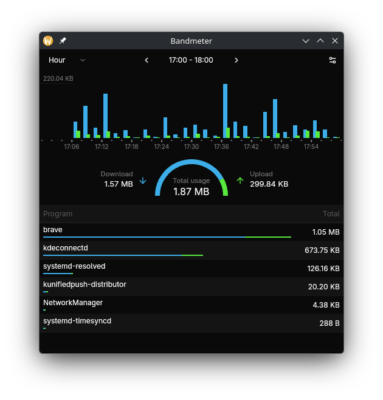

# Bandmeter

Per-program network usage monitor for Linux.

Built with [GPUI](https://www.gpui.rs/) and [Aya](https://aya-rs.dev/book/). Work in progress.



## Build Prerequisites

- stable rust toolchains: `rustup toolchain install stable`
- nightly rust toolchains: `rustup toolchain install nightly --component rust-src`
- bpf-linker: `cargo install bpf-linker`

More information in the [Aya Docs](https://aya-rs.dev/book/start/development)

Build:

```shell
cargo build --release
```

## Binaries

- `bandmeterd` - Service for recording network traffic and writing to database.
- `bandmeter` - GUI for displaying network stats.

## Service install

Create a systemd unit file as `/usr/lib/systemd/system/bandmeter.service`:

```systemd
[Unit]
Description=Per-program network usage monitor

[Service]
Environment="DB_DIR=/path/to/db_dir"   # will be created if non-existent
ExecStart=/path/to/bandmeterd
Restart=on-failure

[Install]
WantedBy=multi-user.target
```

Both binaries require a `DB_DIR` environment variable specifying the directory
where the database file (`bandmeter.db`) will be written / read.

Start the service:

```shell
sudo systemctl start bandmeter
```

Start automatically on boot:

```shell
sudo systemctl enable bandmeter
```

View service status:

```shell
sudo systemctl status bandmeter
```

## Running the GUI

```shell
DB_DIR=/path/to/db_dir /path/to/bandmeter
```

> [!NOTE]
> You can use the <kbd>LEFT</kbd> and <kbd>RIGHT</kbd> arrow keys to navigate periods.

## Features in the works

- Date/time picker & Arbitrary period bounds
- Interactive chart & table with hover tooltips and click-to-filter
- Live updates / traffic streaming when GUI is running
- 'Hosts' table to display IP addresses connected to (database currently records them)
- Configuration options (e.g., retention period, theming, etc.)
- Performance optimisations, Async data fetching
- Error handling & UI feedback
- Window responsiveness
- Accessibility
